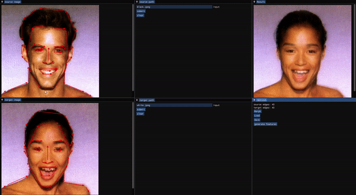
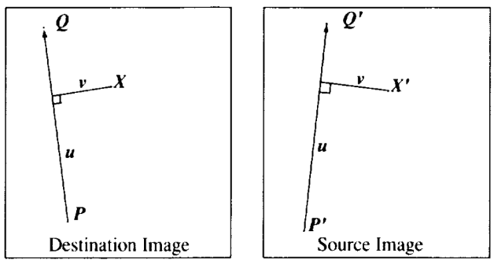
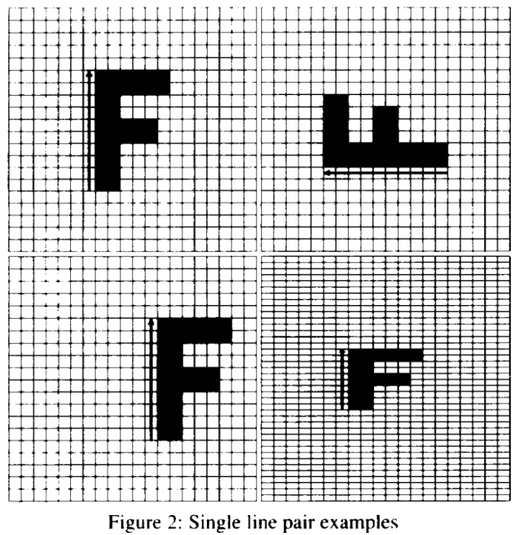
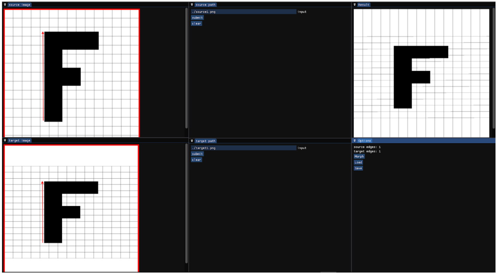
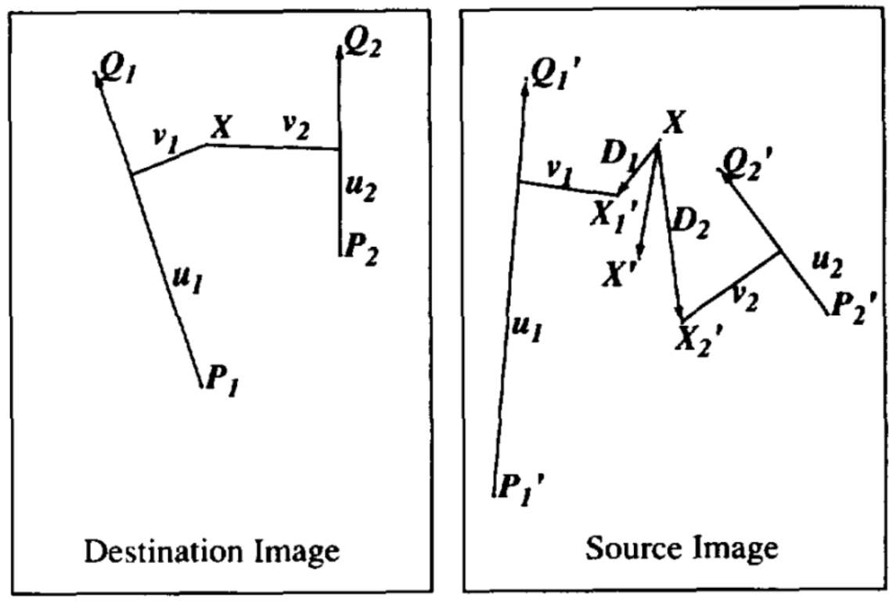
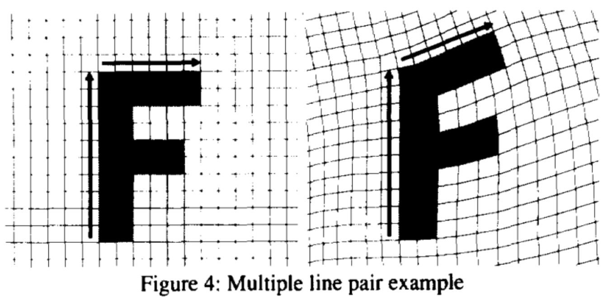
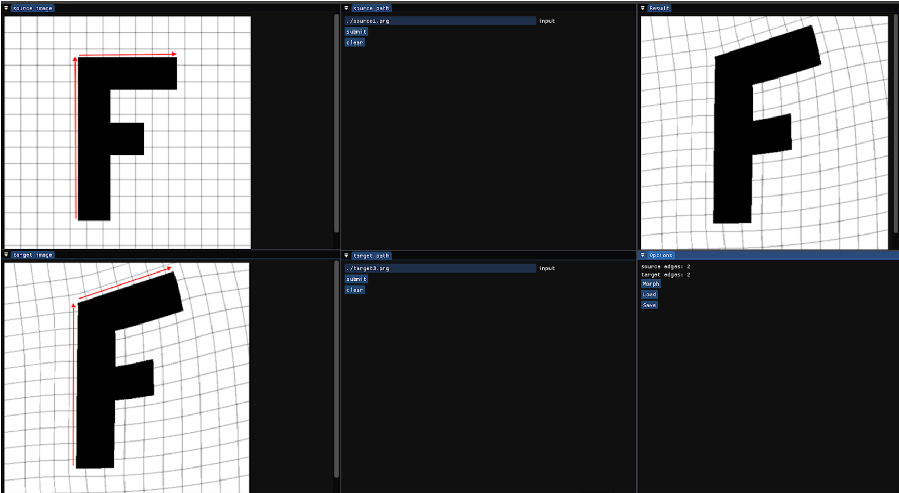
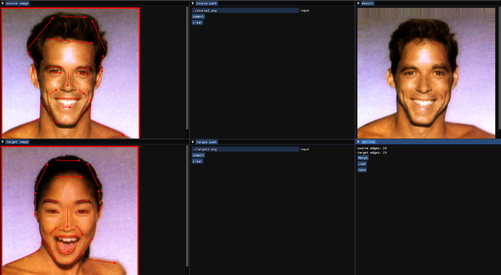
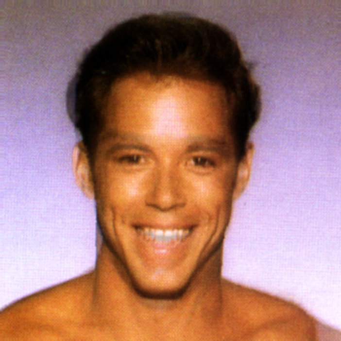
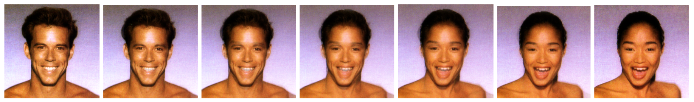

# Introduction
The main objective of the project is to morph a given source image into a given target image based on features. The morphing is done using Feature-based Image Metamorphosis [1]. To achieve this, the traditional methods are to define the features using manual correspondence markers. This process is tedious and would be impossible for a large number of images. We will try to automate the process of defining the correspondence markers as done by Covell [2].
To make this, we will first be implementing manual correspondence, after which we will move on to defining the features automatically using Feature-based Match estimation. We will also give users manual control over tweaking the features detected using Autocorrespondence.

### Below is a sample input and output of the application:

# Implementation
To implement Feature Based Image metamorphosis, we followed Feaeture Based image metamorphosis[1], in which they went step by step, increasing the complexity of transformations at every step. 
We divided our implementation into the following steps:
- Take user input for both the source and the target images
- Take user input for the correspondence markers on the image (line segments)
- Transforming an image using one line pair
- Transforming an image using multiple line pairs
- Transforming a human face
- Reverse Image Transformation
- In Between Frames generation
- Crossfading for In Between Frames
- Automatic correspondence marker generation

We are using ImGui and OpenGL to build our GUI for input/output, and we use stb for storing and manipulating images and their data. 

## Storing the correspondence markers data
The correspondence markers are defined as the `Edge` class in the code. The `Edge` class consists of three attributes which are:
- Head coordinate
- Tail coordinate
- IsDisplaying boolean

The usage of the attributes is self-explanatory. The correspondence markers are stored as a tuple of their head and tail coordinates in two files named `source.edges` and `target.edges`.

## Transforming with one line pair
A pair of lines (one defined relative to the source image, the other defined relative to the destination image) defines a mapping from one image to the other[1]. 
We first create an empty image with the same image type and dimensions as the source image. This image will act as the destination image i.e. the output image after morphing the source image. We now iterate over every pixel of this empty image and find the corresponding pixel value in the source image using the following equations:

 

- `u = ((X - P) . (Q - P)) / ||Q - P||^2`

- `v = ((X - P) . perpendicular(Q - P)) / ||Q - P||`

- `X’ = P’ + u . (Q’ - P’) + (v . perpendicular(Q’ - P’))/||Q’ - P’||`

Where:
- X’ is the value of the corresponding pixel value in the source image
- X is the pixel value of destination image
- perpendicular() function returns a vector perpendicular to a given vector

We recreated some of the examples from the single line pair correspondence and got the same results as the Feature based Image Metamorphosis[1].

 

## Transforming with multiple line pairs
To Implement multiple line pair transformations, for every pixel in the destination image, we need to iterate over all the correspondence markers and calculate their weight in the final displacement of the pixel position from the source image to the destination image.
We do this by calculating the weight of every correspondence marker pair, and take a weighted average of all the displacements.

Where:
- length = len(P’Q’)
- dist is defined as:
    - dist = |v|    for 1 > u > 0,
    - len(XQ)       for u >= 1,
    - len(XP)       for u <= 0
    
Here a, b and p are constants for controlling the warping. These constants will come in handy when we transform a human face since it will need tweaking to get their optimal values for correct morph generation.
We also recreated the example of transformation with multiple line pairs as shown below

## Transforming a human face
To transform a human face, we need to test the correspondence markers with a large number of pairs. This will bring some problems if the markers are nor placed at a certain distance from each other in the form of “ghosts” as defined in the paper[1]. Ghosts are unwanted articles that come in after the transformation if the correspondence markers are interacting with each other  in a certain manner. This mostly occurs when the markers are placed perpendicular to each other, etc.
Some other problems that need to be addressed are the weight of the correspondence markers, how they affect the nearby feature, how they affect the faraway feature, etc. The ideal value ranges for a, b and p were provided in the paper[1] however, to put an exact amount, we needed to do a little testing. We altered the values of one parameter by keeping the others a constant, and then arrived at the following values a, b and p for best results:
- `a = 10`
- `b = 1.5`
- `p = 0.2`

We also recreated the human face morphing example as shown below (note that this is only forward morphing and not both sides. The same algorithm can be applied by interchanging the source and the target images and we can attain the opposite direction morph):

 

## In between frames
To generate in between frames for the final sequence of images, we interpolated every correspondence marker of the source image to the destination image. We increased the Head and tail coordinates linearly from source to destination markers for every frame we generated, and used that intermediate marker to morph the source image to the destination image.

## Crossfading between forward and backward morphs
To create the final morph from one image to another, we need to not just morph from source to destination, but also from destination to source. We generate these interpolated (in-between) frames / morphs and to use these in the final animated sequence, we needed to crossfade between them successively and reduce the opacity of forward generated morph sequence of the source image and reduce increase the opacity of the backward generated morph sequence of the destination image.
We did this by assigning an opacity factor alpha to images of one sequence(forward sequence) and 1-alpha to the other (backward sequence). The initial value of alpha should be 1 since initially, the sequence should have only the source Image with 100% opacity.
While we are rendering the final animated sequence, we decrease the value of alpha from 1 to zero as the last image in the sequence needs to be the destination image.

## Correspondence marker editing
To use the automatically generated edges in the morphing of the image, we need to be able to edit the correspondence markers. To implement editing in the correspondence markers, we use bounding boxes to calculate the intersection of a point (where the mouse has been clicked) and the bounding box. The bounding box is a non axis aligned box which is aligned parallel to the correspondence marker. 
If the result of intersection is true, the program knows that the respective corresponding marker has been clicked for removal and it removes the marker from the respective image. This feature enables the user to edit the correspondence markers.

## Image morph using corrected correspondence markers
Below is the result of the final morphed image sequence using corrected constraints:

## Computational Optimizations
To get better results, we need to add as many in-between frames as possible, this takes up a lot of time for the CPU to be calculated in a single thread. Therefore, we have implemented multi-threading for each in-between image’s morph to be calculated separately. This also eradicates the problems related to the UI freezing while the morph computations are being performed. 

The UI thread and the computation threads are different, hence there is no UI freezing in the application now. To compute the morph of 5 in-between frames using 43 correspondence markers using a single thread, it took 1 minute using a 6-cores 12-threads CPU. For the same computation now using multiple threads, it takes less than 15 seconds on the same machine.
This enhancement greatly improves the computational performance and rescues the time it takes to render the full animated sequence.

# References
- [1] Thaddius Beier and Shawn Neely. 1992. Feature-based Image Metamorphosis. https://www.cs.princeton.edu/courses/archive/fall00/cs426/papers/beier92.pdf
- [2] Mitchell Covell. 1995. Autocorrespondence - Feature-based Image Metamorphosis. https://ieeexplore.ieee.org/stamp/stamp.jsp?arnumber=538197

