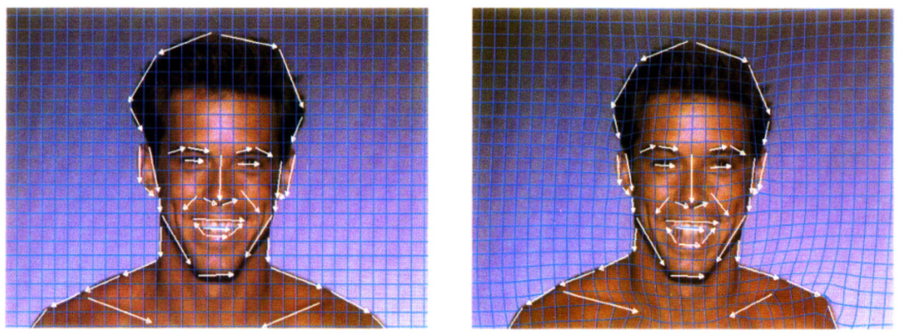

# Introduction
The main objective of the project is to morph a given source image into a given target image based on specified features. The morphing is done using Feature-based Image Metamorphosis[1].

### Below is a sample input and output of the application:


#  Cloning
The project makes use of git submodules. To make sure that all submodules are cloned correctly use the following set of commands.
```
  git clone https://github.com/KaranMano/Image-Morphing
  cd .\Image-Morphing\
  git submodule update --init --recursive
```

# Building
The project uses cmake for make file generation. To build the application make sure all submodules have been cloned(see [cloning](#cloning)). The following set of commands can then be used to generate the required make files for building the application.

```
  mkdir build
  cd build
  cmake ..
```
 After the above commands have completed successfully you can use the generated make files or .sln file, depending upon the operating system and the generator selected, to build the application.

# Implementation
We divided our implementation into the following steps:
- Take user input for both the source and the target images
- Take user input for the correspondence markers on the image (line segments)
- Morphing an image using one line pair
- Morphing an image using multiple line pairs
- Morphing target image to source
- Generation of in between frames
- Crossfading between the morphing steps for the target and source images

The project makes use of ImGui and OpenGL to build the GUI for input and output, and stb for loading and saving images. 

## Storing and loading the correspondence markers
For ease of use the application allows the saving and loading of edge data from files. The edge data is saved in files with the `.edges` extension and contains a serialised representation of the `Edge` class.

## Morphing with one line pair
A pair of lines (one defined relative to the source image, the other defined relative to the destination image) defines a mapping from one image to the other[1]. 
We first create an empty image with the same dimensions as the source image. This image will act as the destination image i.e. the output image after morphing the source image. We now iterate over every pixel of this empty image and find the corresponding pixel value in the source image using the following equations:  
  


- $u = ((X - P) . (Q - P)) / ||Q - P||^2$
- $v = ((X - P) . perpendicular(Q - P)) / ||Q - P||$
- $X’ = P’ + u . (Q’ - P’) + (v . perpendicular(Q’ - P’))/||Q’ - P’||$

Where:
- X’ is the value of the corresponding pixel value in the source image
- X is the pixel value of destination image
- $perpendicular()$ function returns a vector perpendicular to a given vector

We recreated some of the examples from the single line pair correspondence and got the same results as [1].  
  


## Morphing with multiple line pairs
To implement multiple line pair transformations, for every pixel in the destination image, we need to iterate over all the correspondence markers and calculate their weight in the final displacement of the pixel position from the source image to the destination image.
We do this by calculating the weight of every correspondence marker pair, and take a weighted average of all the displacements.


The weights are calculated as follows:  
$weight = (length^p/(a + dist))^b$  
      
Where:
- $length = len(P’Q’)$
- dist is defined as:
    - $dist = |v|$  for $1 > u > 0,$
    - $len(XQ)$     for $u >= 1,$
    - $len(XP)$     for $u <= 0$
    
Here $a$, $b$ and $p$ are constants for controlling the morphing. These constants will come in handy when we transform a human face since they will need tweaking to get optimal values for correct morph generation. The variable $a$ represents the strength of a line at a distance, the smaller it is the stronger strength of a line. The variable $b$ determines how the relative strength of different lines fall off with distance. If it is large, then every pixel will be affected only by the line nearest it. If $b$ is zero, then each pixel will be affected by all lines equally. The variable $p$ controls the weight of a line based in its length, if it is 1 then longer lines have larger weight and if it is 0 then all lines have same weight. 

We also recreated the example of transformation with multiple line pairs as shown below:


## Morphing a human face
To transform a human face, we need to use a large number of correspondence markers. This will cause "ghosts" to appear if the markers are not placed at an appropriate distance from each other[1]. Ghosts are unwanted artifacts that appear after the transformation if the correspondence markers intersect or are very close. For example, they may occur when the markers are placed perpendicular to each other.
It is important for the weight of the correspondence markers to be optimal for a good morph generation. The ideal value ranges for $a$, $b$ and $p$ were provided in the paper[1]. After testing different values of $a$, $b$, $p$ we chose the following values:
- $a = 10$
- $b = 1.5$
- $p = 0.2$

We recreated the human face morphing example as shown below (note that this is only morphing from the source to the target image):
  



## In between frames
To generate in between frames we interpolated the correspondence markers of the source and destination images. At each step of the interpolation we generated a morph using the interpolated correspondence markers.

## Crossfading between forward and backward morphs
To create the final morph from one image to another, we need to not just morph from source to destination, but also from destination to source. We generate interpolated(in-between) frames/morphs and  use them in the final animated sequence by crossfading between them. The crossfading is done by simply multiplying an alpha to the source to destination morphs and (1 - alpha) to the destination to source morphs. This alpha is also interpolated from one to zero along with the correspondence markers.


Below is the final morphed image sequence:


## Computational Optimizations
Morphing is a computationally expensive task especially for images with many correspondence markers, since we have to calcuate the contribution of each marker for every pixel in the source as well as destination images, and do this multiple times for the in-between frames. Hence we used multithreading to generate different morph steps.

# References
- [1] Thaddius Beier and Shawn Neely. 1992. Feature-based Image Metamorphosis. https://www.cs.princeton.edu/courses/archive/fall00/cs426/papers/beier92.pdf

